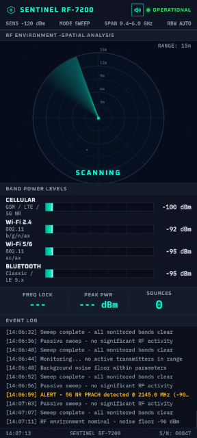

# Notice d'utilisation - SENTINEL RF-7200

Cette application fait semblant de détecter les téléphones, montres connectées et écouteurs sans fil autour de vous. Elle imite un vrai appareil de détection : balayage radar, bips façon compteur Geiger, barres de signal, journal d'événements qui défile.

**L'application ne détecte rien du tout.** C'est une illusion. Vous décidez en secret, d'un simple geste, quand le détecteur s'affole. Idéale pour faire une blague à des amis ou pour intégrer un effet bluffant dans un tour de magie.

## Avant de jouer

1. Installez l'application sur votre téléphone ou votre tablette (fichier APK fourni).
2. Ouvrez-la une fois chez vous pour répéter et bien maîtriser les gestes secrets.
3. Montez le volume, ou branchez une enceinte Bluetooth pour plus d'effet.

## En représentation

1. Lancez l'application devant votre public.
2. Touchez l'écran de démarrage, puis appuyez sur **START SCAN**.
3. Le radar tourne tranquillement, avec quelques bips de temps en temps : tout paraît normal.
4. **Touchez l'écran n'importe où** pour déclencher la détection. Les bips s'accélèrent, les barres de signal montent, des alertes apparaissent.
5. Touchez à nouveau l'écran pour faire redescendre tout doucement.
6. Profitez de la réaction du public.

## Les gestes secrets

| Geste | Effet |
|---|---|
| Toucher l'écran (n'importe où) | Lance ou arrête la détection (le téléphone vibre) |
| Appui long (1,5 s) en bas à droite | Ouvre le panneau caché de réglages (vitesse, volume, remise à zéro) |
| Toucher le losange (logo) | Bascule en plein écran |
| Toucher le haut-parleur | Coupe ou remet le son |

## Conseils pour un meilleur effet

- Tenez l'appareil face au public, écran bien visible.
- Commencez doucement, puis montez en intensité en vous déplaçant.
- Pointez l'appareil vers une personne ou un objet précis pour amplifier le doute.
- Gardez un visage neutre. C'est ce qui rend l'illusion crédible.

## En cas de souci

- **L'écran s'éteint tout seul** : l'application empêche normalement cela. Si le problème persiste, vérifiez qu'elle est bien au premier plan.
- **Pas de son** : touchez l'icône du haut-parleur, ou vérifiez le volume média de l'appareil.
- **Le radar se fige** : revenez à l'écran d'accueil de votre téléphone, puis rouvrez l'application.

## À savoir

- L'application fonctionne entièrement hors-ligne, sans connexion internet.
- Elle ne collecte aucune donnée et n'envoie rien à l'extérieur.
- Elle ne capte ni ondes radio, ni Bluetooth, ni Wi-Fi : tout est simulé.

Amusez-vous bien.
